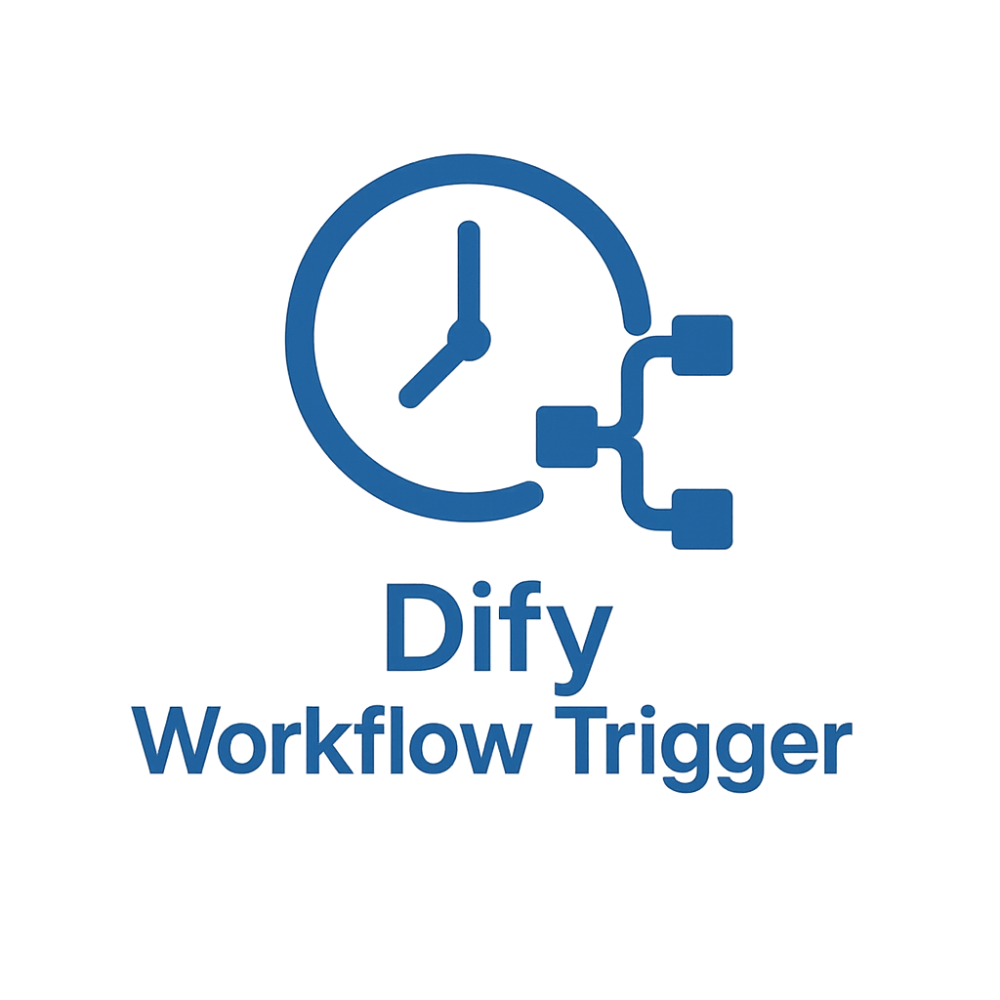
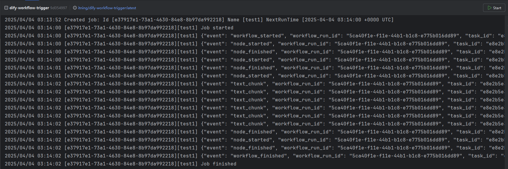

<h3 align="center"></h3>
<div align="center">
    
[](https://github.com/itning/dify-workflow-trigger/stargazers)
[](https://github.com/itning/dify-workflow-trigger/network/members)
[](https://github.com/itning/dify-workflow-trigger/watchers)
[](https://github.com/itning?tab=followers)


</div>

<div align="center">

[](https://github.com/itning/dify-workflow-trigger/issues)
[](https://github.com/itning/dify-workflow-trigger/blob/master/LICENSE)
[](https://github.com/itning/dify-workflow-trigger/commits)
[](https://github.com/itning/dify-workflow-trigger)
[](https://github.com/itning/hit-count)

</div>

---

Dify Workflow Trigger

# 简介

支持定时任务CRON触发Dify工作流执行。

支持多个任务不同时间不同任务调用



# 使用

## 使用二进制文件

1. [下载最新版本](https://github.com/itning/dify-workflow-trigger/releases)
2. 执行
    ```shell
    ./dify-workflow-trigger -config config.json
    ```
   
## 使用Docker

[](https://hub.docker.com/r/itning/dify-workflow-trigger/tags?page=1&ordering=last_updated)

```shell
docker run --name dify-workflow-trigger \
    -v /path/to/config.json:/app/config.json \
    -d itning/dify-workflow-trigger:latest
```

# 配置 config.json

```json
[
   {
      "name": "test1",
      "cron": "TZ=Asia/Shanghai 0 0 18 * * *",
      "url": "http://your-dify-domain/api/v1/workflows/run",
      "token": "app-FZ8vjeH74tUBtRYNUjFx65aw",
      "body": {
         "inputs": {
         },
         "response_mode": "blocking",
         "user": "dify-workflow-trigger"
      },
      "barkNotifyUrlOnFailed": ""
   },
   {
      "name": "test2",
      "cron": "TZ=Asia/Shanghai 0 30 8 * * *",
      "url": "http://your-dify-domain/v1/workflows/run",
      "token": "app-LoFN2hiaYCMfTIhN8yCDmWmo",
      "body": {
         "inputs": {
         },
         "response_mode": "streaming",
         "user": "dify-workflow-trigger"
      }
   }
]
```
对于 `barkNotifyUrlOnFailed` 当task失败时你可以使用 [Bark](https://github.com/Finb/Bark) 进行通知.

配置例子: `"barkNotifyUrlOnFailed": "https://api.day.app/your-bark-token"`

cron 使用库 [go-co-op/gocron](https://pkg.go.dev/github.com/go-co-op/gocron/v2#CronJob)

支持秒级定时: 秒 分 时 日 月 星期

example:
- `TZ=Asia/Shanghai 0 0 18 * * *` 每天18:00执行 (时区: Asia/Shanghai)
- `TZ=Asia/Shanghai 0 30 8 * * *` 每天18:30执行 (时区: Asia/Shanghai)
- `0 0 18 * * *` 每天18:00执行 (默认时区)
- `*/5 * * * * *` 每5秒执行 (默认时区)
