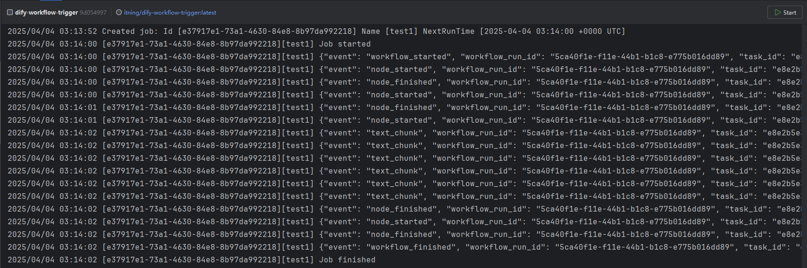

<h3 align="center"></h3>
<div align="center">
    
[](https://github.com/itning/dify-workflow-trigger/stargazers)
[](https://github.com/itning/dify-workflow-trigger/network/members)
[](https://github.com/itning/dify-workflow-trigger/watchers)
[](https://github.com/itning?tab=followers)


</div>

<div align="center">

[](https://github.com/itning/dify-workflow-trigger/issues)
[](https://github.com/itning/dify-workflow-trigger/blob/master/LICENSE)
[](https://github.com/itning/dify-workflow-trigger/commits)
[](https://github.com/itning/dify-workflow-trigger)
[](https://github.com/itning/hit-count)

</div>

---

Dify Workflow Trigger

[中文](https://github.com/itning/dify-workflow-trigger/blob/main/README-CN.md)

# Introduction

Supports triggering Dify workflow execution via CRON scheduled tasks.

Supports multiple tasks with different schedules invoking different workflows.



# Usage

## Using Binary File

1. [Download the latest version](https://github.com/itning/dify-workflow-trigger/releases)
2. Execute
    ```shell
    ./dify-workflow-trigger -config config.json
    ```

## Using Docker

[](https://hub.docker.com/r/itning/dify-workflow-trigger/tags?page=1&ordering=last_updated)

```shell
docker run --name dify-workflow-trigger \
    -v /path/to/config.json:/app/config.json \
    -d itning/dify-workflow-trigger:latest
```

# Configuration `config.json`

```json
[
   {
      "name": "test1",
      "cron": "TZ=Asia/Shanghai 0 0 18 * * *",
      "url": "http://your-dify-domain/api/v1/workflows/run",
      "token": "app-FZ8vjeH74tUBtRYNUjFx65aw",
      "body": {
         "inputs": {
         },
         "response_mode": "blocking",
         "user": "dify-workflow-trigger"
      },
      "barkNotifyUrlOnFailed": ""
   },
   {
      "name": "test2",
      "cron": "TZ=Asia/Shanghai 0 30 8 * * *",
      "url": "http://your-dify-domain/v1/workflows/run",
      "token": "app-LoFN2hiaYCMfTIhN8yCDmWmo",
      "body": {
         "inputs": {
         },
         "response_mode": "streaming",
         "user": "dify-workflow-trigger"
      }
   }
]
```
for `barkNotifyUrlOnFailed` you can use [Bark](https://github.com/Finb/Bark) to notify you when the task fails.

config example: `"barkNotifyUrlOnFailed": "https://api.day.app/your-bark-token"`

cron use [go-co-op/gocron](https://pkg.go.dev/github.com/go-co-op/gocron/v2#CronJob) 

support seconds level scheduling: Seconds Minutes Hours Day-of-Month Month Day-of-Week

example:
- `TZ=Asia/Shanghai 0 0 18 * * *` run at 18:00 every day (timezone: Asia/Shanghai)
- `TZ=Asia/Shanghai 0 30 8 * * *` run at 18:30 every day (timezone: Asia/Shanghai)
- `0 0 18 * * *` run at 18:00 every day (default timezone)
- `*/5 * * * * *` run every 5 seconds (default timezone)

<details>

<summary>About Body</summary>

### Request Body
`inputs` (object) Required Allows the entry of various variable values defined by the App. 

The `inputs` parameter contains multiple key/value pairs, with each key corresponding to a specific variable and each value being the specific value for that variable. The workflow application requires at least one key/value pair to be inputted. The variable can be of File Array type. File Array type variable is suitable for inputting files combined with text understanding and answering questions, available only when the model supports file parsing and understanding capability. If the variable is of File Array type, the corresponding value should be a list whose elements contain following attributions:

`type` (string) Supported type:

`document` ('TXT', 'MD', 'MARKDOWN', 'PDF', 'HTML', 'XLSX', 'XLS', 'DOCX', 'CSV', 'EML', 'MSG', 'PPTX', 'PPT', 'XML', 'EPUB')

`image` ('JPG', 'JPEG', 'PNG', 'GIF', 'WEBP', 'SVG')

`audio` ('MP3', 'M4A', 'WAV', 'WEBM', 'AMR')

`video` ('MP4', 'MOV', 'MPEG', 'MPGA')

`custom` (Other file types)

`transfer_method` (string) Transfer method, `remote_url` for image URL / `local_file` for file upload

`url` (string) Image URL (when the transfer method is `remote_url`)

`upload_file_id` (string) Uploaded file ID, which must be obtained by uploading through the File Upload API in advance (when the transfer method is local_file)

`response_mode` (string) Required The mode of response return, supporting:

`streaming` Streaming mode (recommended), implements a typewriter-like output through SSE (Server-Sent Events).

`blocking` Blocking mode, returns result after execution is complete. (Requests may be interrupted if the process is long) Due to Cloudflare restrictions, the request will be interrupted without a return after 100 seconds.

`user` (string) Required User identifier, used to define the identity of the end-user for retrieval and statistics. Should be uniquely defined by the developer within the application.

Example: file array as an input variable
```json
{
  "inputs": {
    "{variable_name}": 
    [
      {
      "transfer_method": "local_file",
      "upload_file_id": "{upload_file_id}",
      "type": "{document_type}"
      }
    ]
  }
}
```

</details>
